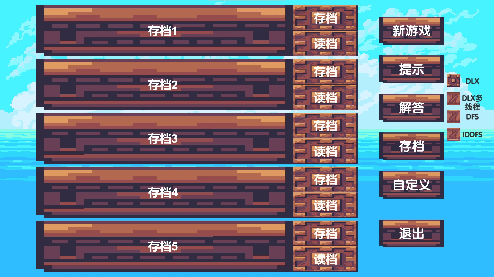

# Sudoku

## 实验题目与要求

本次实验主要内容是实现一个简单的数独软件,具体要求如下

### 基本功能部分

#### 程序说明信息以及交互

程序运行后,显示游戏开始界面,此时点击任意位置进入游戏


在进入游戏过程中会显示游戏基本操作说明


其余游戏基本功能在游戏中通过按钮可以清晰展示,**无需额外说明**


点击退出按钮即可退出游戏

#### 打印数独

在游戏过程中数独的当前状态在屏幕左侧动态显示出来,故**无需额外打印数独操作**

#### 输入数独

点击自定义按钮,进入接受输入数独状态


> 输入是合法的（输入全是数字字符,且已填入位置的行列对角线九宫格不重复）

输入过程中,由于按钮的设计,在试图输入不合法的数字时,点击按钮无效,数字不被接受,因此可以保证输入是合法的


> 我们可以确定的是,对普通数独（9x9）,目前已知至少要有17 个已知数字才可能有唯一解。

在点击确定后,至少含17个数字的合法数独会被固定成为题目,其中题目的数字用***蓝色***显示,与用***白色***显示的玩家填入的数字区分


#### 生成数独

点击新游戏按钮后,程序将会自动生成一个合法数独,此处我使用**挖空法**来保证生成的数独是有解的,但并不保证有**唯一解**


生成的题目中预先给出的数字个数统一设定为21

#### 输出数独的解

点击解答按钮,如果数独有解,输出数独的一个解


#### 填入数字合法情况

通过点击按钮向数独中填入数字


如果填入数字合法,将会在数独中直接显示


#### 填入数字异常情况

> 如果试图修改题目固定的数字

**蓝色**显示的题目固定的数字方格在点击后也会显示1-9的小按钮,但点击后无任何反应


> 如果填入的数字过大

输入数字只能使用输入1-9,不存在填入的数字过大的情况

> 如果输入的填入位置不合法

输入数字只能使用每个数字方格对应的按钮输入,不存在填入位置不合法的情况

> 如果填入的数字和已有数字重复

在填入的数字如果与行列对角线九宫格重复,数字将不会被填入,同时所有相同数字会被标为**红色**以提示错误


#### 数独提示信息

点击提示按钮后,程序将会求解当前数独,选取其中的一个解,并按照从左到右,从上到下的顺序,选择第一个未填数字的方格显示答案中应有的数字


可以通过不停的提示获得最终的一个解

#### 保存游戏状态

点击存档按钮可以打开存档列表,在游戏中设计了五个存档位置,可以保存5个不同的存档



在每个存档的右侧有**存档**和**读档**两个按钮,点击存档会显示存档名输入界面


在此界面可以使用键盘输入存档名字,存档名字只可以为英文大写字母,并且不支持删除字母


点击确定后存档保存完成,存档名输入界面和存档列表淡出,恢复到数独界面

如果保存的存档位置已有存档,将会覆盖原先的存档,不同存档的存档名可以相同

#### 加载游戏状态

点击存档按钮可以打开存档列表,点击读档即可载入先前保存的存档


在存档名中会记录存档保存的时间,存档中存有题目以及玩家输入的数字

### 扩展部分

#### 图形化界面

图形化界面用`Unity 2021.1.7f1c1 (64-bit)`实现,脚本语言采用`C#`

#### 高级搜索技巧

在基础的DFS算法之外,实现了GBFS(贪婪最佳优先算法)与DLX(跳舞链)两种高级搜索算法,都可以独立完成对对角线数独的求解


设计了四个选项按钮,在解答前选择不同的选项,再点击解答按钮将会采用不同的算法进行求解,同时四个按钮在同一时刻仅能有一个被选中


>Issues #90<br>
zhiyuan @PB17121741<br>
这一得分点的设置目的主要是鼓励同学们了解通用的高级搜索技术,并将其进行具体实现。对于特化的一些解数独的算法其实偏离了我们的设计目的。如果使用dlx算法作为高级算法提交,首先需要额外增加数独类型开关,指定数独为不考虑对角线的数独；其次实现dlx算法解不考虑对角线的数独。

实际上,DLX算法可以实现对**对角线数独**的求解,因此未增加数独类型开关,而是实现了DLX对对角线数独的求解

#### 多线程优化

使用多线程技术,采用DLX算法并行搜索输出数独全部的解


选择DLX多线程选项后点击解答,会在数独右侧显示**上一个**和**下一个**两个按钮


点击**下一个**后可以开始查看数独所有可能的解


点击**上一个**和**下一个**可以在不同的解之间进行切换


## 具体设计

该部分**简单介绍**实验中的函数拆分与图形化实现的细节,例如,包括哪些函数,函数参数是什么,作用是什么等。扩展功能的介绍等。

### 数独基本单元的构造

使用预制体`prefab`来构造数独方格,然后进行实例化

```C#
for (int i = 0; i < 9; i++)
    for (int j = 0; j < 9; j++)
    {
        Data.unitarray[i, j] = Instantiate(prefab);
        Data.unitarray[i, j].transform.GetComponent<Unit>().i = i; Data.unitarray[i, j].transform.GetComponent<Unit>().j = j;
        Data.unitarray[i, j].GetComponent<RectTransform>().localPosition = new Vector3((j / 3) * 20 + 95 * j + 1920 / 2 - 700, -(i / 3) * 20 - 95 * i + 1080 / 2 + 420);
        Data.unitarray[i, j].transform.SetParent(father);
    }
```

数独方格本身是一个按钮,又包含9个小按钮来支持数字的修改

```C#
public void ChangevalueByButton(int number)//通过按钮修改单元的值
{
    int i = transform.GetComponent<Unit>().i, j = transform.GetComponent<Unit>().j;
    if (Data.question[i][j] != 0) return;
    if (Sudoku.put(ref Data.condition, i, j, number))
        Sudoku.printSudoku(ref Data.condition);
    else
    {
        Sudoku.printSudoku(ref Data.condition);
        for(int m=0;m<9;m++)
            for(int n=0;n<9;n++)
                if(Data.condition[m][n]==number) 
                    Data.unitarray[m,n].transform.Find("Value").GetComponent<Text>().color = new Color(1, (50f / 255), 0);
    }
}
```

同时支持外部函数调用来修改数字

```C#
public void Changevalue(int number)//修改单元的值
{
    int i = transform.GetComponent<Unit>().i, j = transform.GetComponent<Unit>().j;
    if (number == 0)
        transform.Find("Value").GetComponent<Text>().text = "";
    else
        transform.Find("Value").GetComponent<Text>().text = number.ToString();
    if (Data.question[i][j] == 0)
        transform.Find("Value").GetComponent<Text>().color = new Color(1, 1, 1);
    else
        transform.Find("Value").GetComponent<Text>().color = new Color((71f / 255), (243f / 255), 1);
}
```

增加了对鼠标右键点击的监听,通过鼠标右键来删除已填写的数字

``` C#
void Start()
{
    rightClick.AddListener(new UnityAction(ButtonRightClick));
}
public void OnPointerClick(PointerEventData eventData)
{
    if (eventData.button == PointerEventData.InputButton.Right)
        rightClick.Invoke();
}
private void ButtonRightClick()//右键删除数字
{
    int i = transform.GetComponent<Unit>().i, j = transformGetComponent<Unit>().j;
    if (Data.question[i][j] != (char)0) return;
    Data.condition[i][j] = (char)0;
    Sudoku.printSudoku(ref Data.condition);
}
```

### 数据的存储

使用静态类`Data`来实现对基本变量的统一调度

```C#
static public GameObject[,] unitarray = new GameObject[10, 10];
static public List<List<char>> question = new List<List<char>>(9);
static public List<List<char>> condition = new List<List<char>>(9);
static public List<List<char>> solution = new List<List<char>>(9);
static public int now;//当前sudoku的解的序数,从1开始
static public int sudokunum;//当前的sudoku的数组下标,从0开始
static public List<DLX> sudoku = new List<DLX>();
static public List<List<List<int>>> matrix = new List<List<List<int>>>();
```
同时编写了对`List<List<char>>`进行初始化与拷贝的函数

```C#
static public void initboard(ref List<List<char>> board)//初始化
{
    board.Clear();
    for (int i = 0; i < 9; i++)
    {
        List<char> row = new List<char> { (char)0, (char)0, (char)0, (char)0, (char)0, (char)0, (char)0, (char)0, (char)0 };
        board.Add(row);
    }
}
static public void copyboard(ref List<List<char>> des, refList<List<char>> sorce)//复制
{
    des.Clear();
    for (int i = 0; i < 9; i++)
    {
        List<char> row = new List<char>();
        for (int j = 0; j < 9; j++)
            row.Add(sorce[i][j]);
        des.Add(row);
    }
}
```
### 数独的基本本功能

#### 当前数独状态的输出

通过调用数独方格的`public void Changevalue(int number)`来实现输出

```C#
static public void printSudoku(ref List<List<char>> board)//输出数独
{
    for (int i = 0; i < 9; i++)
        for (int j = 0; j < 9; j++)
            Data.unitarray[i, j].GetComponent<Unit>().Changevalue((int)(board[i][j]));
}
```
#### dfs算法求解数独

使用深度优先搜索完成对数独的求解

```C#
static private void dfs(ref List<List<char>> board, int pos)//深度优先索
{
    if (pos == spaces.Count)
    {
        valid = true;
        return;
    }
    int i = spaces[pos].Key, j = spaces[pos].Value;
    int mask = line[i] | column[j] | block[i / 3, j / 3];
    if (i == j) mask |= diagonal[0]; if (i + j == 8) mask |= diagonal[1];//x数独
    mask = ~(mask) & 0x1ff;
    for (; mask != 0 && !valid; mask &= (mask - 1))
    {
        int digit = __builtin_ctz(mask);
        flip(i, j, digit);
        board[i][j] = (char)(digit + 1);
        dfs(ref board, pos + 1);
        flip(i, j, digit);
    }
}
```

为提高效率,对数独行列九宫格对角线的状态进行`状态压缩`

```C#
static private int __builtin_ctz(int x)//获取二进制数末尾的0的个数
{
    int digit = 0;
    while ((x & (1 << digit)) == 0) digit++;
    return digit;
}

static private void flip(int i, int j, int digit)//改变某一位状态
{
    line[i] ^= (1 << digit);
    column[j] ^= (1 << digit);
    block[i / 3, j / 3] ^= (1 << digit);
    if (i == j) diagonal[0] ^= 1 << digit; if (i + j == 8) diagonal[1] ^= 1 << digit;//x数独
}
```

#### 提示功能

通过求解数独再选取第一个空格填入正确答案来实现提示

```C#
static public KeyValuePair<int, int> hint(ref List<List<char>> board)/提示
{
    KeyValuePair<int, int> pos = new KeyValuePair<int, int>(-1, -1);
    if (isfinish(ref board)) return pos;
    for (int i = 0; i < 9; i++)
        for (int j = 0; j < 9; j++)
            if (pos.Key == -1 && board[i][j] == (char)0) pos = new KeyValuePair<int, int>(i, j);
    if (solve_Sudoku(ref board))
        return pos;
    return new KeyValuePair<int, int>(-1, -1);
}
```
#### 整个数独合法性的判断

逐个将数字填入,并更新行列九宫格对角线的状态,直到数字填完或出现矛盾为止

```C#
static public bool judge(ref List<List<char>> board, bool output)//整数独判断
{
    for (int i = 0; i < 9; i++)
        for (int j = 0; j < 9; j++)
            if (board[i][j] < 0 || board[i][j] > 9)
                return false;
    Array.Clear(line, 0, line.Length);
    Array.Clear(column, 0, column.Length);
    Array.Clear(block, 0, block.Length);
    Array.Clear(diagonal, 0, diagonal.Length);//x数独
    valid = false;
    for (int i = 0; i < 9; ++i)
        for (int j = 0; j < 9; ++j)
            if (board[i][j] != 0)
            {
                int digit = board[i][j] - 1;
                int mask = line[i] | column[j] | block[i / 3, j / 3];
                if (i == j) mask |= diagonal[0]; if (i + j == 8) mask |= diagonal[1];//x数独
                if (((1 << digit) & mask) != 0)
                    return false;
                flip(i, j, digit);
            }
    return true;
}
```

#### 填入数字

将数字填入后调用`static public bool judge(ref List<List<char>> board, bool output)`进行判断

```C#
static public bool put(ref List<List<char>> board, int line, intcolumn, int number)//填入数字
{
    board[line][column] = (char)number;
    if (!judge(ref board, true))
    {
        board[line][column] = (char)0;
        return false;
    }
    return true;
}
```

#### 生成数独

采用挖空法生成数独以保证数独有解,首先随机填入6个数字,然后对数独进行求解,求解完成后再随机挖去50个数字得到最终的题目

```C#
static public void generate(ref List<List<char>> board)//生成数独
{
    int step = 0;
    while (true)
    {
        int number, line, column;
        while (step <= 6)
        {
            number = ra.Next(1, 9); line = ra.Next(0, 8); column = raNext(0, 8);
            board[line][column] = (char)(number);
            if (!judge(ref board, false)) board[line][column] = (char)0;
            else step++;
        }
        if (solve_Sudoku(ref board)) break;
    }
    for (step = 1; step <= 60; step++)
    {
        int line = ra.Next(0, 9), column = ra.Next(0, 9);
        if (board[line][column] == 0) step--;
        board[line][column] = (char)(0);
    }
}
```

#### 判断数独是否解答完毕

逐个判断每个格子是否都有数字填入,因不合法的数字的填入不被允许,因此数字全部填入后一定是满足题目的合法解

```C#
static public bool isfinish(ref List<List<char>> board)//判断游戏是否完成
{
    for (int i = 0; i < 9; ++i)
        for (int j = 0; j < 9; ++j)
            if (board[i][j] == 0)
                return false;
    return true;
}
```

使用`Update()`动态检测数独是否完成

```C#
void Update()//检测游戏是否完成
{
    if (Sudoku.isfinish(ref Data.condition))
        transform.GetComponent<Animator>().SetBool("End", true);
}
```
### 存档功能

存档功能依托于Unity的本地持久化类`PlayerPrefs`,但它不能存储数组,因此编写了`PlayerPrefsX`类来实现对数独的二维数字的存取

```C#
public static class PlayerPrefsX
{
    public static void SetInt2Array(string key, int[,] int2Array)//保存二维数组
    {
        int[] intArray = new int[81];
        for (int i = 0; i < 9; i++)
            for (int j = 0; j < 9; j++)
                intArray[i * 9 + j] = int2Array[i, j];
        SetIntArray(key, intArray);
    }

    public static int[,] GetInt2Array(string key)//获取二维数组
    {
        int[] intArray = GetIntArray(key);
        if (intArray.Length == 0)
        {
            intArray = new int[81];
            Array.Clear(intArray, 0, intArray.Length);
        }
        int[,] int2Array = new int[10, 10];
        for (int i = 0; i < 9; i++)
            for (int j = 0; j < 9; j++)
                int2Array[i, j] = intArray[i * 9 + j];
        return int2Array;
    }

    public static bool SetIntArray(string key, int[] intArray)//保存一维数组
    {
        if (intArray.Length == 0) return false;

        System.Text.StringBuilder sb = new System.Text.StringBuilder();
        for (int i = 0; i < intArray.Length - 1; i++)
            sb.Append(intArray[i]).Append("|");
        sb.Append(intArray[intArray.Length - 1]);

        try { PlayerPrefs.SetString(key, sb.ToString()); }
        catch { return false; }
        return true;
    }

    public static int[] GetIntArray(string key)//获取一维数组
    {
        if (PlayerPrefs.HasKey(key))
        {
            string[] stringArray = PlayerPrefs.GetString(key).Split("|"[0]);
            int[] intArray = new int[stringArray.Length];
            for (int i = 0; i < stringArray.Length; i++)
                intArray[i] = Convert.ToInt32(stringArray[i]);
            return intArray;
        }
        return new int[0];
    }
}
```

实现了读取时间并将其格式化为字符串的功能

```C#
public static String time() //获取当前时间
{
    int hour = DateTime.Now.Hour, minute = DateTime.Now.Minute, second = DateTime.Now.Second,
    year = DateTime.Now.Year, month = DateTime.Now.Month, day = DateTime.Now.Day;
    return string.Format("{0:D2}:{1:D2}:{2:D2} " + "{3:D4}/{4:D2}/{5:D2}", hour, minute, second, year, month, day);
}
```

通过`Keycode`枚举读取用户输入的存档名字母

```C#
if (inputnumber != 0)
    if (Input.anyKeyDown)
        foreach (KeyCode keyCode in Enum.GetValues(typeof(KeyCode)))
            if (Input.GetKeyDown(keyCode) && ((int)keyCode) >= 97 && ((int)keyCode) <= 122)
```

### GBFS算法的实现

在DFS的每一步都对当前局面进行判断,启发式的寻找可行状态数最少的空继续迭代,同时也能够在最小状态数为0时回溯

使用`static private KeyValuePair<int, int> find(ref List<List<char>> board)`启发式寻找下一层迭代的最优位置

```C#
static private KeyValuePair<int, int> find(ref List<List<char>> board)
{
    int max = int.MaxValue; KeyValuePair<int, int> pos = new KeyValuePair<int, int>(-1, -1);
    for (int i = 0; i < 9; i++)
        for (int j = 0; j < 9; j++)
        {
            if (board[i][j] == 0)
            {
                int mask = line[i] | column[j] | block[i / 3, j / 3];
                if (i == j) mask |= diagonal[0]; if (i + j == 8) mask |= diagonal[1];//x数独
                mask = ~(mask) & 0x1ff;
                if (mask == 0) return new KeyValuePair<int, int>(-1, -1);
                int num = 1;
                while ((mask &= (mask - 1)) != 0) num++;
                if (num == 1) return new KeyValuePair<int, int>(i, j);
                if (num < max) pos = new KeyValuePair<int, int>(i, j);
            }
        }
    return pos;
}
```

### DLX算法实现

> 在计算机科学中,X算法可用来求解精确覆盖问题。此名称最早在高德纳的论文《舞蹈链》中出现,他认为此算法是“试错法中最显而易见”的。就技术而言,X算法是一个深度优先的不确定性回溯算法。由于X算法是一个解决精确覆盖问题的简洁方法,高德纳希望通过该算法体现舞蹈链数据结构的高效性,他把使用后者的X算法称为DLX。

DLX算法的基本框架如下

```C#

public class Node
{
    public Node up; public Node down; public Node left; public Node right; public Node colRoot; public Node rowRoot;
    public int Num; public int Size;//行数 列元素数
    public Node(int i = -1) //构造函数
    {
        Num = i;
        Size = 0;
    }
};

private Node Head;
private List<int> result = new List<int>();
private int _row, _col;
public List<List<int>> solve = new List<List<int>>();
public DLX(ref List<List<int>> matrix, int m, int n)//构造函数
{
    _row = m;
    _col = n;
    Head = new Node();
    Head.up = Head;
    Head.down = Head;
    Head.right = Head;
    Head.left = Head;
    init();
    link(ref matrix);
}
private void init()//初始化行列
{
    Node newNode;
    for (int ix = 0; ix < _col; ++ix) //表头向后构造列对象
    {
        newNode = new Node();
        newNode.up = newNode;
        newNode.down = newNode;
        newNode.right = Head.right;
        newNode.left = Head;
        newNode.right.left = newNode;
        Head.right = newNode;
    }
    for (int ix = 0; ix < _row; ++ix) //表头向下构造行对象
    {
        newNode = new Node(_row - ix);
        newNode.down = Head.down;
        newNode.up = Head;
        newNode.down.up = newNode;
        Head.down = newNode;
    }
}
private void link(ref List<List<int>> matrix)//连接各个节点
{
    Node current_row = Head, current_col, newNode, current; //当前行对象,当前列对象,新节点,当前节点
    for (int row = 0; row < _row; ++row)
    {
        current_row = current_row.down; current_col = Head;
        for (int col = 0; col < _col; ++col)
        {
            current_col = current_col.right;
            if (matrix[row][col] == 0)
                continue;
            newNode = new Node();
            newNode.colRoot = current_col;
            newNode.rowRoot = current_row;
            newNode.down = current_col;
            newNode.up = current_col.up;
            newNode.up.down = newNode;
            current_col.up = newNode;
            if (current_row.Size == 0)
            {
                current_row.right = newNode;
                newNode.left = newNode;
                newNode.right = newNode;
                current_row.Size++;
            }
            current = current_row.right;
            newNode.left = current.left;
            newNode.right = current;
            newNode.left.right = newNode;
            current.left = newNode;
            current_col.Size++;
        }
    }
}
private void cover(ref Node cRoot) //覆盖列
{
    cRoot.left.right = cRoot.right;
    cRoot.right.left = cRoot.left; //删除该列对象
    Node i = cRoot.down, j;
    while (i != cRoot)
    {
        j = i.right;
        while (j != i)
        {
            j.down.up = j.up;
            j.up.down = j.down;
            j.colRoot.Size--;
            j = j.right;
        }
        i = i.down;
    }
}
private void recover(ref Node cRoot) //恢复列
{
    Node i = cRoot.up, j;
    while (i != cRoot)
    {
        j = i.left;
        while (j != i)
        {
            j.colRoot.Size++;
            j.down.up = j;
            j.up.down = j;
            j = j.left;
        }
        i = i.up;
    }
    cRoot.right.left = cRoot;
    cRoot.left.right = cRoot;
}
public bool Search(int k = 0)//搜索求解
{
    if (Head.right == Head)
        return true;
    Node cRoot = new Node(), c;
    int minSize = int.MaxValue;
    for (c = Head.right; c != Head; c = c.right) //启发式搜索
    {
        if (c.Size < minSize)
        {
            minSize = c.Size;
            cRoot = c;
            if (minSize == 1)
                break;
            if (minSize == 0)
                return false;
        }
    }
    cover(ref cRoot);
    Node current_row, current;
    for (current_row = cRoot.down; current_row != cRoot; current_row = current_row.down)
    {
        result.Add(current_row.rowRoot.Num);
        for (current = current_row.right; current != current_row; current = current.right)
        {
            cover(ref current.colRoot);
        }
        if (Search(k + 1))
            return true;
        for (current = current_row.left; current != current_row; current = current.left)
            recover(ref current.colRoot);
        result.RemoveAt(result.Count - 1);
    }
    recover(ref cRoot);
    return false;
}
```

在DLX算法中,将精准覆盖问题抽象成从某个01矩阵中选取某些行,使得得到的子矩阵的每一列都有且仅有一个1

求解数独问题也可以看成一个精准覆盖问题,数独的每个限制条件都可以当作矩阵的一列,分别有:数独每一格都有数字(81)+行不重复(81)+列不重复(81)+九宫格不重复(81)+对角线不重复(18)=342列,在数独的一个格子填入的一个数字可以抽象成矩阵的一行,这样就可以将对角线数独转化为01矩阵从而用DLX算法进行求解

```C#
static public List<List<int>> sudoku2matrix(string problem) //将数独转为01矩阵
{
    List<List<int>> matrix = new List<List<int>>();
    for (int ix = 0; ix < 81; ++ix)
    {
        int val = problem[ix];
        List<int> current_row = new List<int>();
        //for (int i = 1; i <= 324; i++) current_row.Add(0);
        for (int i = 1; i <= 342; i++) current_row.Add(0); //x数独
        if (val != 0)
        {
            current_row[ix] = 1;
            current_row[81 + ix / 9 * 9 + val - 1] = 1;
            current_row[162 + ix % 9 * 9 + val - 1] = 1;
            current_row[243 + (ix / 9 / 3 * 3 + ix % 9 / 3) * 9 + val - 1] = 1;
            if (ix / 9 == ix % 9)//x数独
                current_row[324 + val - 1] = 1; //x数独
            if (ix / 9 + ix % 9 == 8)//x数独
                current_row[333 + val - 1] = 1; //x数独
            matrix.Add(current_row);
            continue;
        }
        for (int jx = 0; jx < 9; ++jx)
        {
            List<int> current_row2 = new List<int>();
            //for (int i = 1; i <= 324; i++) current_row2.Add(0); 
            for (int i = 1; i <= 342; i++) current_row2.Add(0); //x数独
            current_row2[ix] = 1;
            current_row2[81 + ix / 9 * 9 + jx] = 1;
            current_row2[162 + ix % 9 * 9 + jx] = 1;
            current_row2[243 + (ix / 9 / 3 * 3 + ix % 9 / 3) * 9 + jx] = 1;
            if (ix / 9 == ix % 9)//x数独
                current_row2[324 + jx] = 1; //x数独
            if (ix / 9 + ix % 9 == 8)//x数独
                current_row2[333 + jx] = 1; //x数独
            matrix.Add(current_row2);
        }
    }
    return matrix;
}
public List<int> matrix2sudoku(ref List<List<int>> matrix, List<int>result) //将01矩阵转换为数独（也可以static）
{
    List<int> solution = new List<int>();
    for (int i = 1; i <= 81; i++) solution.Add(0);
    for (int ix = 0; ix < 81; ++ix)
    {
        List<int> current = matrix[result[ix] - 1];
        int pos = 0, val = 0;
        for (int jx = 0; jx < 81; ++jx)
        {
            if (current[jx] == 1)
                break;
            ++pos;
        }
        for (int kx = 81; kx < 162; ++kx)
        {
            if (current[kx] == 1)
                break;
            ++val;
        }
        solution[pos] = val % 9 + 1;
    }
    return solution;
}
```

### 多线程求全部解

找到数独的第一个空格,分别填入1-9,判断合法性后,对合法的情况分别用DLX算法求解

```C#
static public void solve()//测试函数
{
    for (int i = 0; i < 9; i++)
        for (int j = 0; j < 9; j++)
            if (Data.solution[i][j] == 0)
            {
                for (int k = 1; k <= 9; k++)
                {
                    Data.solution[i][j] = (char)k;
                    if (Sudoku.judge(ref Data.solution, false))
                    {
                        List<List<char>> branch = new List<List<char>>();//复制solution中的内容到branch,避免不同线程读取时solution改变
                        Data.initboard(ref branch);
                        for(int m=0;m<9;m++)
                            for(int n=0;n<9;n++)
                                branch[m][n]=Data.solution[m][n];
                        Thread thread = new Thread(new ParameterizedThreadStart(solve));
                        thread.Start(branch);
                    }
                }
                return;//仅通过第一个空格来分支多线程
            }
}
static void solve(object obj)//求解线程函数
{
    List<List<char>> solution=(List<List<char>>)obj;
    List<List<int>> current = null;
    DLX sudoku=Sudoku.solve_SudokuMuliti(ref solution, ref current);
    if(sudoku.solve.Count!=0)
    {   
        Data.sudoku.Add(sudoku);
        Data.matrix.Add(current);
    }
}
```

### 界面的设计

数独显示在游戏界面左侧,按钮显示在界面右侧,通过Unity中的`Animation`实现对UI元素的调动

流程图如下所示


进入游戏后首先进入开始界面,然后进入游戏界面

在游戏胜利后进入游戏结束界面,然后重新返回游戏界面,这是三角小循环

在点击存档后进入存档界面,保存存档后回到游戏界面,这是菱形小循环

## 实验过程

该部分介绍实验中遇到的bug与报错

### 报错

- 报错内容

    `ArgumentOutOfRangeException: Index was out of range. Must be non-negative and less than the size of the collection.`

- 报错原因

    C#中的`List<T>`泛型类需要初始化后才能直接使用数组下标访问

- 解决方案

    在使用数组下标访问前,先用0填充进行初始化

### bug1

- bug内容

    将`List<List<char>>>`进行复制后发现修改复制后的内容会影响原对象的内容

- bug原因

    C#中的`List<T>`泛型类中的T若仍是`<List<char>>`会采用传递引用

- 解决方案

    不采用直接赋值的方式,而是采用对元素逐个赋值的方式进行复制

### bug2

- bug内容

    使用多线程进行求解时发现不同线程求出相同的解

- bug原因

    不同线程的执行顺序并不依赖于调用顺序,在主线程对题目进行修改时,调用的线程可能还没能完成对题目的读取,这样会造成两个先后调用的线程本应读取不同的题目却读取了相同的题目

- 解决方案

    将题目复制成为一个新对象,传递给线程,这样就解除了不同线程对同一个对象进行读取的问题


## 实验总结

该部分介绍实验中的收获。

在这次实验中熟悉了`DFS`算法的使用,新学习了`GBFS`与`DLX`两种高级搜索算法,学习了`Unity`的基本使用方法,同时对Unity所使用的`C#`语言有了一定的了解,通过与本学期所学习的`C++`进行对比,对面向对象的编程语言有了深入理解,学习了C++与C#中`多线程`的调用与执行方式,通过编写这样一个小项目,也提高了代码组织能力和问题的发现与解决能力
